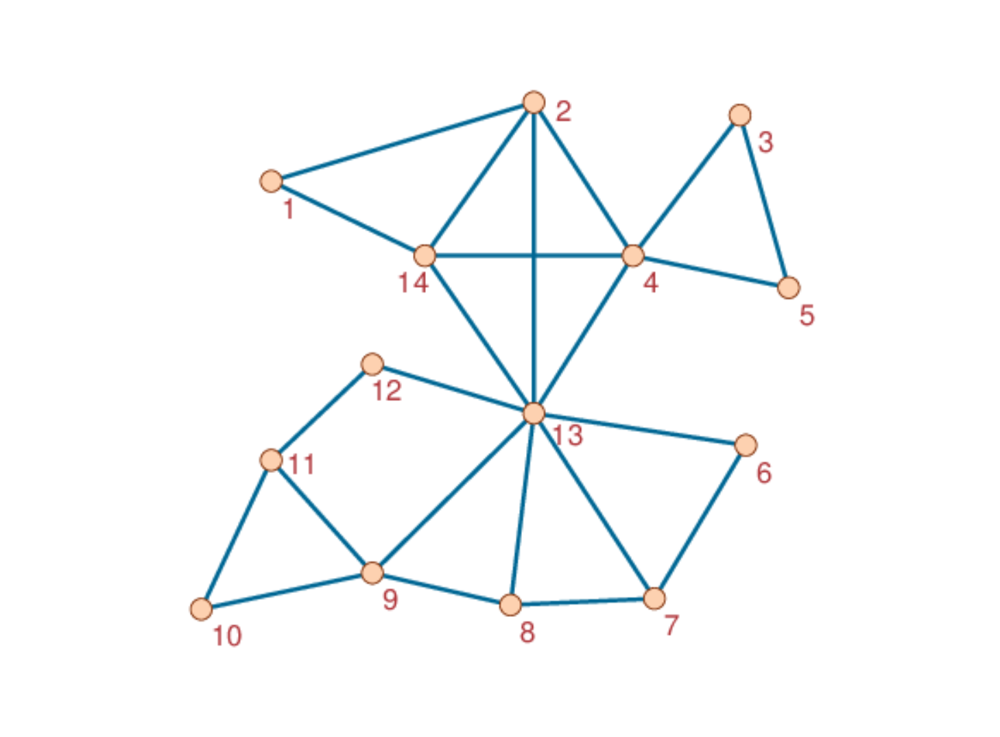

# DisjointCliqueCover.jl

## Description

This package [DisjointCliqueCover](https://github.com/giubuig/DisjointCliqueCover.jl), written in the [Julia](https://julialang.org) language, implements a method to estimate a minimal _edge-disjoint edge clique cover (EECC)_ of a graph, according to the heuristic presented in Burgio et al. [[1](#Reference-1)]. A minimal edge clique cover is a minimal set of cliques able to cover the entire set of edges in the graph. In a EECC, the cliques are required to be all edge-disjoint, i.e., they can have no more than one node in common.

A graph can admit multiple minimal edge clique covers and finding one of them is known to be a NP-complete problem [[2](#Reference-1)]. Therefore, approximate heuristics are needed to estimate it in large graphs.

The notion of EECC is introduced in [[1](#Reference-1)] as a basis to define the Microscopic Epidemic Clique Equations (MECLE) model. This is a discrete-time markovian model describing complex contagion processes on higher-order networks, represented as hypergraphs and, specifically, as simplicial complexes. The model builds upon the cliques in the underlying graph of a considered higher-order network. As shown in [[1](#Reference-1)], in order to account for the higher-order dynamical correlations among the states of the nodes in those cliques, the latter are required to be edje-disjoint. This leads to the search for the EECC of the underlying graph, hence to the respective heuristic whose source code is here provided.

As an example, the following graph admits a unique minimal EECC

```@raw html

```
which is given by

```@setup gettingstarted
using LightGraphs
using Random
using DisjointCliqueCover

Random.seed!(666)

N = 14
edges_list = [(1, 2), (1, 14), (2, 4), (2, 13), (2, 14), (3, 4), (3, 5), (4, 5), (4, 13),
              (4, 14), (6, 7), (6, 13), (7, 8), (7, 13), (8, 9), (8, 13), (9, 10), (9, 11),
              (9, 13), (10, 11), (11, 12), (12, 13), (13, 14)]

G = SimpleGraph(N)
for e in edges_list
  add_edge!(G, e[1], e[2])
end

m₀ = 4 
eecc = get_EECC(G, m₀)
```

```@example gettingstarted
for c in eecc  # hide
  println(c)  # hide
end  # hide
```

## References

1. Giulio Burgio, Alex Arenas, Sergio Gómez and Joan T. Matamalas: Network clique cover approximation to analyze complex contagions through group interactions, _Comms. Phys._ (2021) in press ([arXiv:2101.03618](https://arxiv.org/abs/2101.03618))

2. Lawrence T. Kou, Larry J. Stockmeyer and Chak Kuen Wong: Covering edges by cliques with regard to keyword conflicts and intersection graphs, _Comms. ACM_ **21**(2) (1978) 135–139 ([doi](https://doi.org/10.1145/359340.359346))


## Authors

- [Giulio Burgio](https://scholar.google.es/citations?user=jnYkpVoAAAAJ) (Universitat Rovira i Virgili, Tarragona, Spain)

- [Alex Arenas](http://deim.urv.cat/alexandre.arenas) (Universitat Rovira i Virgili, Tarragona, Spain)

- [Sergio Gómez](http://deim.urv.cat/~sergio.gomez) (Universitat Rovira i Virgili, Tarragona, Spain)

- [Joan T. Matamalas](https://www.linkedin.com/in/jtmatamalas) (Harvard Medical School & Brigham and Women's Hospital, Boston, USA)
